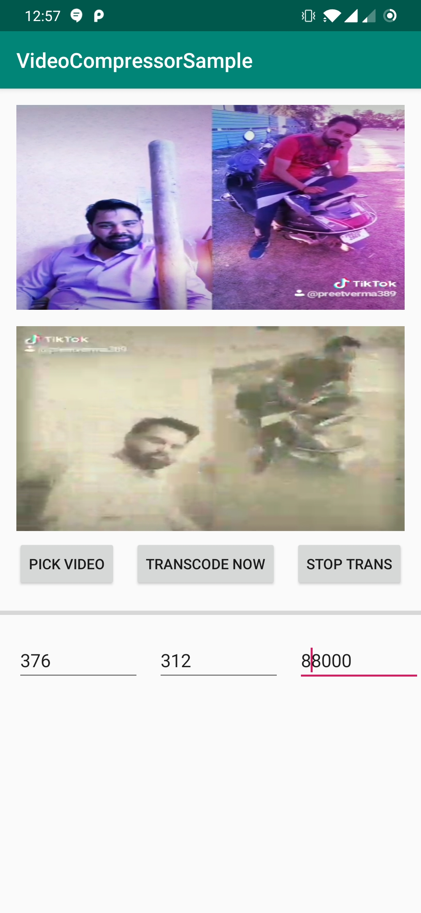

# KTVideoTranscoder

A Android Library to transcode video and strip down the width/height and bitrate

Special thanks to https://github.com/ypresto/android-transcoder
##ScreenShots

## Getting Started

KTMediaTranscoder class has the utility functions to get the info for the video and transcoding options.

## License

This project is licensed under the Apache 2.0 License - see the [LICENSE](LICENSE) file for details